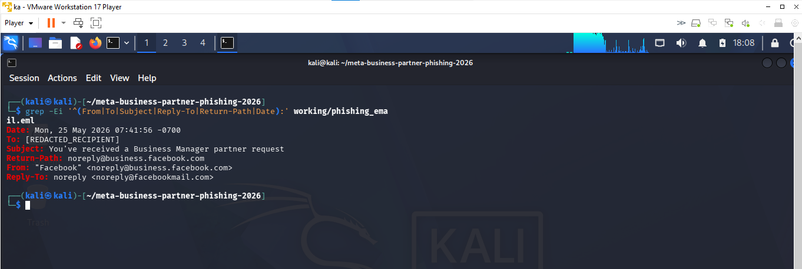
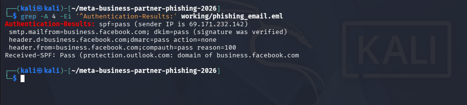
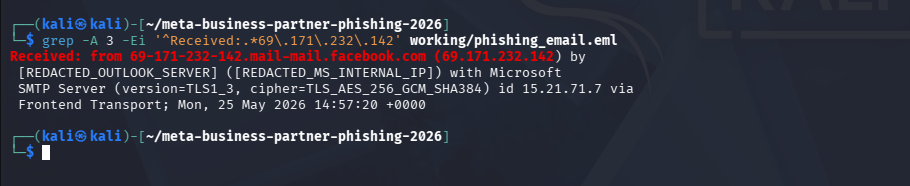
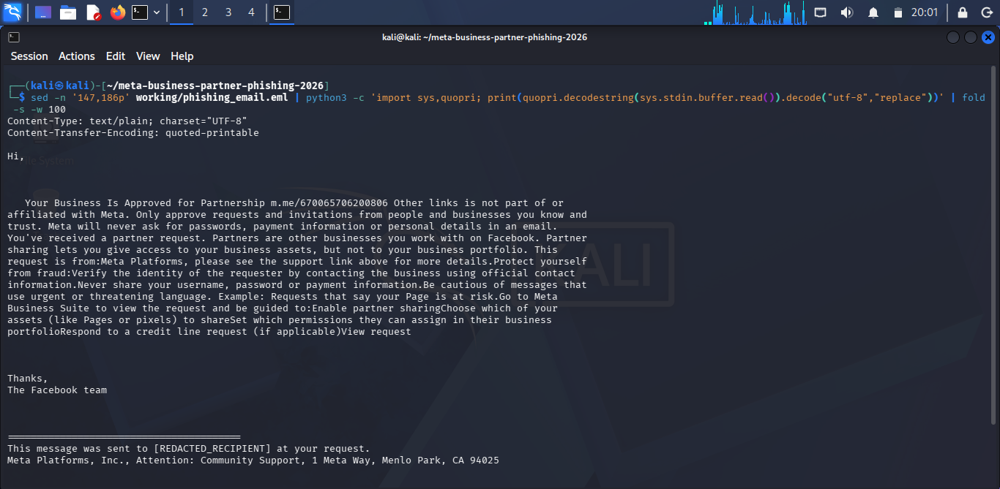
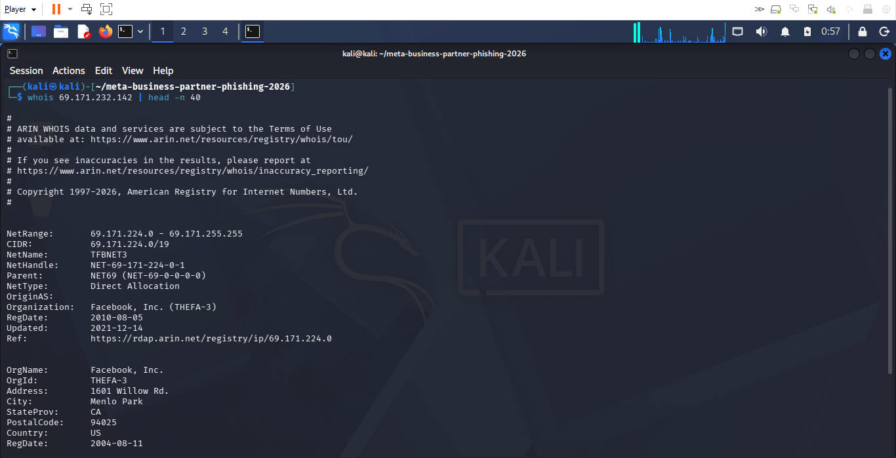
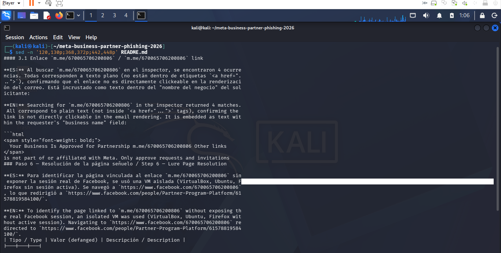

# Meta Business Manager Phishing Analysis — 2026

## Overview

This project documents the investigation of a phishing campaign that abused Meta's legitimate Business Manager partner-request workflow.

Unlike traditional phishing emails, the analyzed message was delivered through legitimate Facebook/Meta infrastructure and successfully passed SPF, DKIM, and DMARC authentication checks.

The suspicious activity was instead embedded within attacker-controlled content inside the Business Manager request itself, including a Messenger lure placed in the requester-controlled business name field.

The investigation focused on:

* Email-header and authentication analysis
* Sender infrastructure verification
* Safe decoding of the email body
* Identification and classification of case indicators
* Passive threat-intelligence corroboration
* MITRE ATT&CK mapping
* Incident timeline development
* Escalation and containment decisions
* Management-level incident reporting

## Investigation Objective

The objective was to determine whether the message represented traditional sender spoofing or abuse of a legitimate trusted platform, identify the relevant indicators, assess potential impact, and document an appropriate SOC response.

## Environment and Evidence

The investigation was performed from a Kali Linux analysis environment using command-line tools to inspect and decode the email safely without opening embedded links directly.

### Evidence Sample

* File: `meta_partner_request_REDACTED_FULL.eml`
* File type: RFC 822 email
* Size: approximately 27 KB
* SHA-256: `1eeaa096c337dbd4cc5660757fd22aed287f7a2e90294eba0554dafc95245a04`

The calculated SHA-256 hash matched the hash supplied with the source evidence, confirming that the analyzed copy was identical to the published sample.

### Evidence Handling

The original sample was kept unchanged in the source evidence directory.

A separate working copy was created for analysis so that parsing and decoding could be performed without modifying the original evidence.

The public sample was already redacted to remove recipient and internal infrastructure details. The source of the sample is documented separately in `SAMPLE_SOURCE.md`.

## Investigation Methodology

The investigation followed a structured SOC-style workflow.

### 1. Evidence Preservation

The original `.eml` sample was preserved and its SHA-256 hash was calculated and compared against the supplied reference hash.

### 2. Header Triage

The message headers were reviewed to identify:

* Sender
* Return-Path
* Reply-To
* Subject
* Message timestamps
* Mail-routing information
* Authentication results

### 3. Authentication Analysis

SPF, DKIM, and DMARC results were examined to determine whether the message relied on sender spoofing.

All three authentication mechanisms passed, indicating that the message was sent through legitimate Meta infrastructure rather than through a forged sender domain.

### 4. Infrastructure Verification

The sending IP address `69.171.232.142` was identified from the mail headers and independently checked using WHOIS.

The address was confirmed as part of infrastructure registered to Facebook, Inc.

### 5. Email Body Analysis

The message contained both plain-text and HTML MIME parts using quoted-printable encoding.

The body was decoded locally from the command line without opening embedded links.

This revealed attacker-controlled text containing the Messenger identifier:

`m.me/670065706200806`

### 6. Link and Request Analysis

The HTML content was reviewed to distinguish legitimate Meta Business Manager links from attacker-controlled text.

The legitimate "View request" button pointed to Meta Business Manager, while the Messenger lure appeared as plain text within the requester-controlled business name field.

The following case-specific identifiers were extracted:

* Messenger ID: `670065706200806`
* Partner Request ID: `980425691238214`
* Business Manager ID: `2836451836418284`

### 7. Threat-Intelligence Corroboration

The findings were compared against public reporting and the source investigator's documented analysis.

External findings were treated as corroboration and were clearly separated from observations independently reproduced during this investigation.

### 8. ATT&CK Mapping and SOC Assessment

Observed activity was mapped conservatively to MITRE ATT&CK techniques supported by the evidence.

An incident timeline, escalation decision, and containment/recovery recommendations were then developed based on the findings.

## Key Findings

The investigation identified several important characteristics that distinguish this case from a conventional spoofed phishing email.

### Legitimate Sender Infrastructure

The message originated from `69.171.232.142`.

WHOIS analysis confirmed that the IP belongs to Facebook, Inc. and is part of Meta/Facebook mail infrastructure.

This means the sending IP should not be treated as a malicious blocking indicator.

### Email Authentication Passed

The message successfully passed:

* SPF
* DKIM
* DMARC
* Microsoft composite authentication

The authenticated domain was `business.facebook.com`.

This demonstrated that successful sender authentication does not necessarily mean the content of a message is trustworthy.

### Legitimate Meta Workflow Was Abused

The email was a genuine Meta Business Manager partner-request notification.

The attacker-controlled content appeared inside the requester-controlled business name field rather than through a spoofed sender address or lookalike domain.

The suspicious text included:

`Your Business Is Approved for Partnership m.me/670065706200806 Other links`

### Messenger Lure Was Not an HTML Link

HTML inspection showed that `m.me/670065706200806` was present as plain text rather than as an `<a href>` hyperlink.

The legitimate "View request" button instead pointed to a valid `business.facebook.com` URL.

This indicates that the phishing lure relied on the recipient manually following the Messenger reference.

### Case-Specific Identifiers

The following identifiers were extracted from the message:

* Messenger ID: `670065706200806`
* Partner Request ID: `980425691238214`
* Business Manager ID: `2836451836418284`

These identifiers were treated as case-specific evidence rather than automatically classified as malicious infrastructure.

### Threat-Intelligence Corroboration

The original source investigation reported that the Messenger identifier resolved, in an isolated virtual machine, to a Facebook page named "Partner Program Platform".

That lure-page resolution was not independently reproduced in this investigation and is therefore treated as source-reported corroboration rather than an independently verified finding.

### Overall Assessment

The available evidence supports abuse of a legitimate Meta Business Manager workflow for phishing and social engineering.

The activity is more consistent with trusted-platform abuse than with traditional sender spoofing.

## MITRE ATT&CK Mapping

The activity was mapped conservatively to techniques directly supported by the evidence.

| Tactic             | Technique                           | ID          | Evidence                                                                                                                         |
| ------------------ | ----------------------------------- | ----------- | -------------------------------------------------------------------------------------------------------------------------------- |
| Initial Access     | Phishing: Spearphishing via Service | `T1566.003` | A legitimate Meta Business Manager workflow was used to deliver the phishing lure.                                               |
| Social Engineering | Impersonation                       | `T1684.001` | Attacker-controlled request text impersonated Meta Platforms and attempted to appear as an official Meta business communication. |

Several additional techniques described in the source investigation were not included as confirmed mappings because the available evidence did not independently demonstrate those actions.

Examples excluded from the final mapping included MFA interception, financial theft, account-access removal, and trusted-relationship abuse.

This approach avoids overstating adversary behavior that was not directly observed in the analyzed sample.

## Incident Timeline

The following timeline was reconstructed from the email headers and message content.

| Time                       | Event                                                                                                                                                   |
| -------------------------- | ------------------------------------------------------------------------------------------------------------------------------------------------------- |
| 25 May 2026 07:41:56 -0700 | Meta-generated Business Manager partner-request email was created/sent.                                                                                 |
| 25 May 2026 14:57:20 +0000 | Microsoft mail infrastructure received the message from `69.171.232.142`, a Facebook/Meta-owned mail server.                                            |
| 25 May 2026 14:57:23 +0000 | The message was processed through the recipient's Outlook environment.                                                                                  |
| During content analysis    | The email was found to contain the attacker-controlled business-name text `Your Business Is Approved for Partnership m.me/670065706200806 Other links`. |

### Timeline Assessment

The available evidence shows that the lure was delivered through a legitimate Meta notification workflow.

There is no evidence in the sample showing that the recipient clicked the lure, approved the partner request, disclosed credentials or MFA codes, or suffered account compromise.

## Escalation Decision and Response

### Classification

Confirmed phishing / social-engineering attempt involving abuse of a legitimate Meta Business Manager workflow.

### Initial Severity

Medium

The incident was escalated because the phishing lure was delivered through trusted Meta infrastructure and successfully passed SPF, DKIM, and DMARC authentication.

This reduces the effectiveness of traditional sender-authentication checks and increases the likelihood that a recipient may trust the message.

### Compromise Status

No confirmed compromise was identified from the available evidence.

The sample does not show that the recipient:

* interacted with the Messenger lure
* approved the partner request
* disclosed credentials or MFA codes
* lost access to a Meta Business account
* experienced unauthorized advertising or asset changes

### Recommended Actions

If the recipient did not interact with the lure:

* Remove or quarantine the message.
* Warn the recipient not to follow the Messenger reference or approve the partner request.
* Review recent Meta Business Manager partner requests for similar activity.
* Monitor the affected account for unusual invitations or permission changes.
* Report the suspicious partner request through Meta's official channels.

If the recipient interacted with the lure:

- Revoke unauthorized partner access immediately.
- Review Pages, ad accounts, pixels, payment settings, and business permissions.
- Reset the affected account password.
- Revoke active sessions.
- Review and reconfigure MFA if credentials or codes may have been disclosed.
- Investigate recent advertising and payment activity.
- Preserve Meta account and activity logs for further investigation.

### Recovery

Recovery should confirm that only legitimate administrators and partners retain access, account recovery information is correct, MFA remains securely configured, and no unauthorized business assets or permissions remain.

## Investigation Evidence

The following screenshots were captured during the investigation and document the analysis process.

### 1. Sender Header Triage

Shows the sender, Return-Path, Reply-To, subject, and message date extracted directly from the `.eml` file.

### 2. Email Authentication Results

Shows SPF, DKIM, DMARC, and Microsoft composite authentication successfully passing for `business.facebook.com`.

### 3. Sending Infrastructure

Shows the message being received from Facebook/Meta mail infrastructure at `69.171.232.142`.

### 4. Decoded Phishing Lure

Shows the locally decoded plain-text email body containing the suspicious Messenger reference.

### 5. Suspicious Request Text

Isolates the attacker-controlled business-name text:

`Your Business Is Approved for Partnership m.me/670065706200806 Other links`

### 6. Sender IP WHOIS

Shows WHOIS results confirming that the sending IP range is registered to Facebook, Inc.

### 7. Threat-Intelligence Corroboration

Shows comparison with the source investigation, including the reported Messenger lure page and associated Meta identifiers.

> The screenshots in this project were captured during my own investigation. Screenshots included in the original source repository were not reused as investigation evidence.
